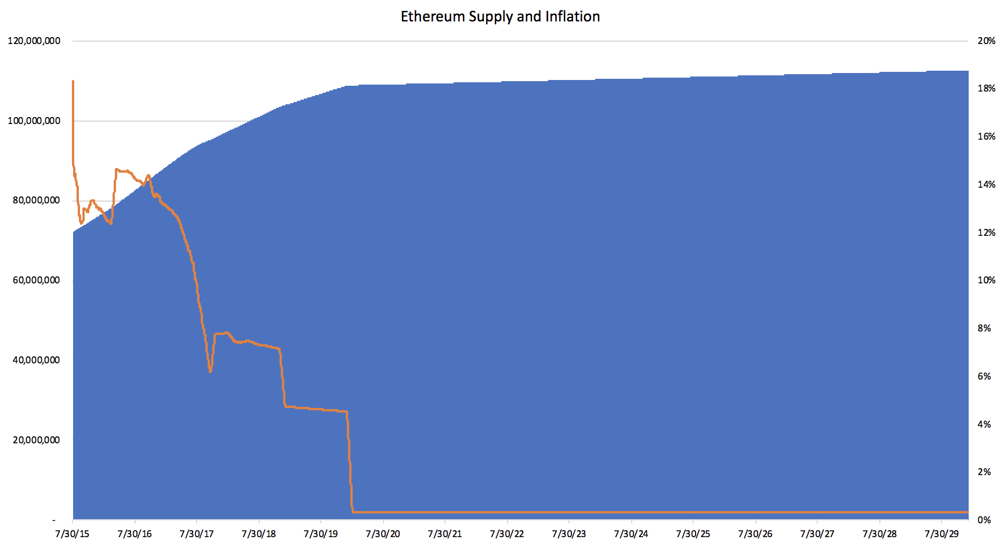

# Monetary Policy

#### Genesis Block

As part of the Ethereum [genesis block](../key-concepts/genesis-block.md), contributors to the Ethereum [pre-sale](../history/pre-mainnet.md#presale) were allocated 60,000,000 Ether. Another 12,000,000 Ether was given to the development fund which was distributed among early contributors and the [Ethereum Foundation](../key-concepts/ethereum-foundation.md).

#### Block Rewards

Every block produced on the Ethereum network has an associated block reward which incentivizes miners to support the network. On top of the base block reward, miners that find an [uncle block](../key-concepts/uncle-block.md) receive ~75% of the current block reward. This results in a growing supply of Ether across time. The history of the block reward are as follows:

* Block 0 to Block 4,369,999 : 5 Ether
* Block 4,370,000 to current: 3 Ether \(changed via [EIP-649](https://github.com/ethereum/EIPs/blob/master/EIPS/eip-649.md)\)


It is currently planned that in the Constantinople hard fork, targeted for the end of 2018, block rewards will drop to 2 Ether per block via [EIP-1234](https://github.com/ethereum/EIPs/blob/master/EIPS/eip-1234.md).


#### Proof of Stake Impact

According to the current [Shading+Casper spec](https://notes.ethereum.org/s/Syj3QZSxm), block rewards will be greatly reduced as a part of Proof of Stake. There will be a sliding scale between total amount of Ether at stake and annual interest earned by stakers. The current spec would produce the following annual interest and inflation numbers:

#### Supply Forecast

_This following supply forecast assumes EIP-1234 is implement on 12/1/2018 and_ [_Proof of Stake_](../../roadmap/layer-2-scaling/) _is implemented on 1/1/2020 with an average of 10,000,000 ETH staked._

